# Radix-2 4-Bit Booth's Multiplier

## Description

This project simulates the Radix-2 4-Bit Booth's Multiplier using Verilog HDL. It can be used to multiply two 4-bit binary signed number in a efficient manner with less number of addition operation. 

## Introduction

Booth's Multiplier is based on Booth's Multiplication Algorithm. It proposes an efficient way for multiplying two signed intergers in there 2's complement form such that the number of partial products is reduced which ultimately lead to the reduction of number of addition operation required for generating the final result.

## Application

Booth's Multiplier can be found to have wide application in field of Digital Signal Processing such as

* They can be used as a fundamental unit for MAC block.
* They can be used in filters like FIR and IIR.
* They can be used in Processing Element of Systolic Array. 

 They can basically be used in any application requiring high speed multiplcaition. 
 
 ## Block Diagram 
 
The Booth's Multiplier perform iterations of shift, addition and subtraction operation in order to produce the result.
 
 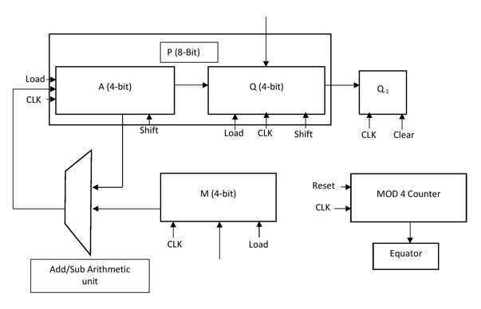
 
As shown in the Block Diagram, Q and M are 4-bit registers that stores the multiplier and multipliicand respectively. It also consist of a 4-bit arthematic unit capable of performing both addition and subtractions. A MOD-4 counter is also present in order to keep track of shifting operation. A and Q are 4-bit shift register. The product is produced in 8_bit register P.  

## Working 

The  multiplication operation through Booth’s algorithm is efficient compared to traditional shift and multiplication process because it produces the result with lesser addition operation. 

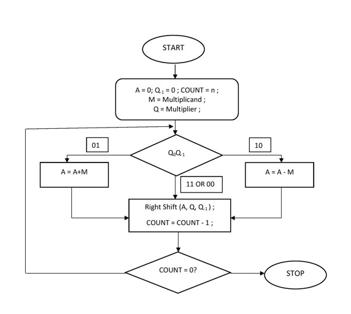

The above figure shows the flowchart of Booth’s Algorithm. At every clock cycle the two bits (Q<sub>0</sub> , Q<sub>-1</sub>)  are inspected for determination of operation .The Q<sub>0</sub>  refers to Q[0]. If the (Q<sub>0</sub> , Q<sub>-1</sub>) are same (1,1) 0r (0,0) then only right shift operation is performed. If the (Q<sub>0</sub> , Q<sub>-1</sub>) are same (1,0) then subtraction (A-M) followed by right shift is performed. If the (Q<sub>0</sub> , Q<sub>-1</sub>) are same (0,1) then addition (A+M) followed by right shift operation is performed. This cycle is repeated as many times as the specified bits of Booth’s Multiplier is given. This selectivity in performing addition /subtraction operation enables it to produce result efficiently. 

## RTL Simulation


The above figure shows the simulated wavefrom of the Radix-2 4-Bit Booth's Multiplier.

* The Multiplier is Q = 1011 which is in 2's complement form and in signed decimal form = -5. 
* Similarly Multiplicand M = 1010, signed decimal = -6. 
* Product is P = 00011110, signed decimal = 30. 

## RTL Netlist

This is a RTL level Netlist of the Radix-2 4-Bit Booth's Multiplier generated by Yosys.


## Skywater130 PDK Physical Cell Mapping 

This is a physical cell mapping of Radix-2 4-Bit Booth's Multiplier done in Yosys. The cells used are of Skywater 130nm PDK.

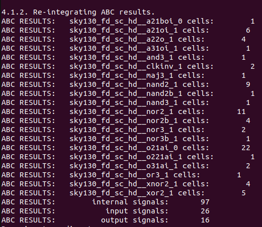

## Gate Level Netlist 

This is a gate level Netlist of the Radix-2 4-Bit Booth's Multiplier generated by Yosys. The cells used are of Skywater 130nm PDK.

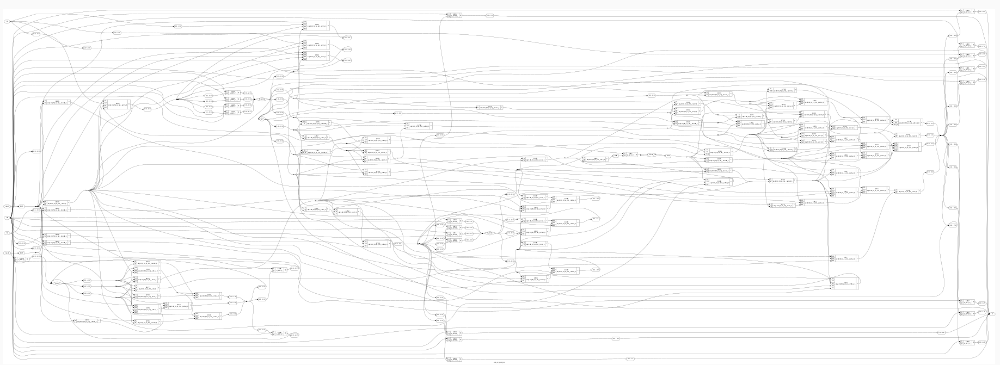

## Gate Level Simulation (GLS)


The above figure shows the Gate Level simulated wavefrom of the Radix-2 4-Bit Booth's Multiplier.

* The Multiplier Q = 1011, signed decimal form = -5. 
* Multiplicand M =   1010, signed decimal = -6. 
* Product  is  P = 00011110, signed decimal = 30. 

## Physical Design

### Preparation

The Physical Design is performed using the OpenLane flow. In order to accomplish it, certian preparation has to be done . Copy the `config.json` to the `Openlane/designs/iiitb_r2_4bit_bm` directory. Also copy the `iiitb_r2_4bit_bm.v` , `sky130_vsdinv.lef` , `sky130_fd_sc_hd_fast.lib` , `sky130_fd_sc_hd_slow.lib` and `sky130_fd_sc_hd_typical.lib`  in `Openlane/designs/iiitb_r2_4bit_bm/src`. The contents of the `config.json` file are  

```
{
    "DESIGN_NAME": "iiitb_r2_4bit_bm",
    "VERILOG_FILES": "dir::src/iiitb_r2_4bit_bm.v",
    "CLOCK_PORT": "clk",
    "CLOCK_NET": "clk",
    "GLB_RESIZER_TIMING_OPTIMIZATIONS": true,
    "CLOCK_PERIOD": 10,
    "PL_TARGET_DENSITY": 0.7,
    "FP_SIZING" : "relative",
    "pdk::sky130*": {
        "FP_CORE_UTIL": 40,
        "scl::sky130_fd_sc_hd": {
            "FP_CORE_UTIL": 30
        }
    },
    
    "LIB_SYNTH": "dir::src/sky130_fd_sc_hd__typical.lib",
    "LIB_FASTEST": "dir::src/sky130_fd_sc_hd__fast.lib",
    "LIB_SLOWEST": "dir::src/sky130_fd_sc_hd__slow.lib",
    "LIB_TYPICAL": "dir::src/sky130_fd_sc_hd__typical.lib",  
    "TEST_EXTERNAL_GLOB": "dir::../iiitb_r2_4bit_bm/src/*"

}
```

Now, open the terminal in the OpenLane directory, and type the following commands to invoke it

```
make mount
```
Now to run the OpenLane flow in the interactive mode enter the command

```
./flow.tcl -interactive
```
Now to proceed to import the design for the physical design under the desired tag

```
prep -design iiitb_r2_4bit_bm -tag ASIC
```

Now to merge the sky130_vsdinv lef file to the merged.nom.lef enter the following commands one after the other 

```
set lefs [glob $::env(DESIGN_DIR)/src/*.lef]
add_lefs -src $lefs
```
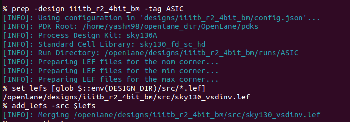

The file `merged.nom.lef` should contain the sky130_vsdinv macro


### Synthesis 

The synthesis in the OpenLane flow is carried out by `yosys` . After that the technology mapping is carried out by the `abc`. After that an static timing analysis (STA) is carried out by the `OpenSTA`.

To run synthesis enter the command 

```
run_synthesis
```


#### The Synthesis report 

The statistic regarding the skywater130 cells which are mapped on to the design.


```
Flop Ratio = Ratio of total number of flip flops / Total number of cells present in the design = 24/112 = 0.2143
```

If the macro sky130_vsdinv is synthesised on the design then the sky130_vsdinv will be reflected on the sythesised netlist.


### Floorplan 

The floorplan conssist of various process such as determining the core area for macro, rows and tracks , I/O placement, power distribution network generation and inserting welltap ,and decap cells. 

To proceed with floorplan enter the command 

```
run_floorplan 
```


Core Area

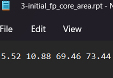

Die Area


#### Floorplan View

To view the floorplan in `magic` navigate to the directory `OpenLane/designs/iiitb_r2_4bit_bm/run/ASIC/result/floorplan` and then enter the commands

```
magic -T /home/yashm98/openlane_dir/OpenLane/pdks/sky130A/libs.tech/magic/sky130A.tech ../../tmp/merged.nom.lef def read iiitb_r2_4bit_bm.def &
```


### Placement

In placement the flow performs the global placement of cells followed by the detailed placement.

To proceeed with placement enter the command

```
run_placement
```


#### Placement View

To view the placement in `magic` navigate to the directory `OpenLane/designs/iiitb_r2_4bit_bm/run/ASIC/result/placement` and then enter the commands

```
magic -T /home/yashm98/openlane_dir/OpenLane/pdks/sky130A/libs.tech/magic/sky130A.tech ../../tmp/merged.nom.lef def read iiitb_r2_4bit_bm.def &
```

The sky130_vsdinv will be present in the netlist and .def file after placement 

  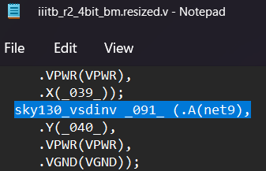

Placement View

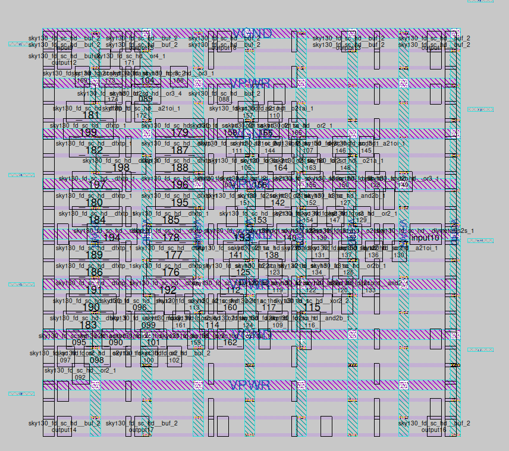

sky130_vsdinv in placement view

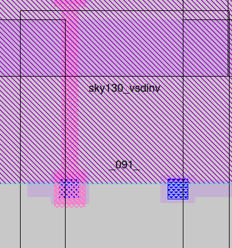

### Clock Tree Synthesis (CTS)

The process involves the synthesis of clock tree distribution

To proceeed with CTS , enter the command 

```
run_cts
```


### Routing 

The process involves global routing and detailed routing followed by parasitic (SPEF) extraction 

To proceed with routing , enter the command 

```
run_routing
```


#### Complete layout View

To view the routing in `magic` navigate to the directory `OpenLane/designs/iiitb_r2_4bit_bm/run/ASIC/result/routing` and then enter the commands

```
magic -T /home/yashm98/openlane_dir/OpenLane/pdks/sky130A/libs.tech/magic/sky130A.tech ../../tmp/merged.nom.lef def read iiitb_r2_4bit_bm.def &
```

The sky130_vsdinv will be present in the netlist and .def file after placement 

   

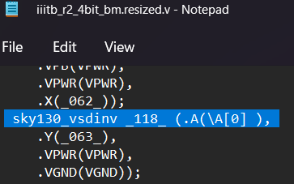

Complete layout in magic


Complete layout in Klayout

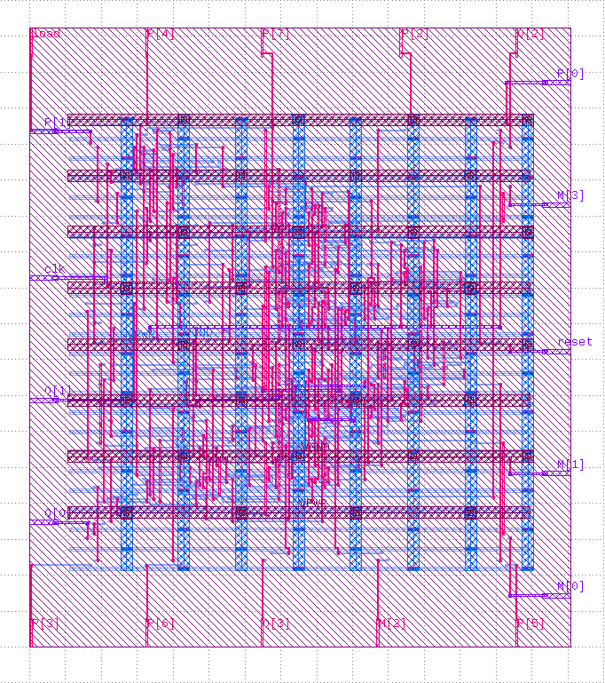

sky130_vsdinv in Layout view

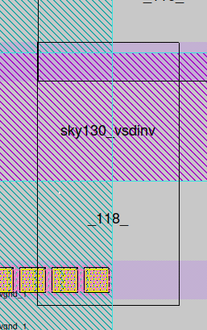

The area report in magic


 ## Post Layout Result
 
 ### 1. Total Cells
 
 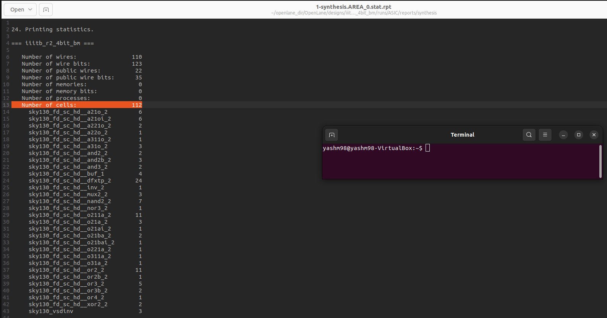
 
 ```
 Total number of Cells = 112
 ```
 ### 2. Area 
 
 
 
 ```
 Area = 7966.123 um<sup>2</sup>
 ```
 
 ### 3.Performance
 
 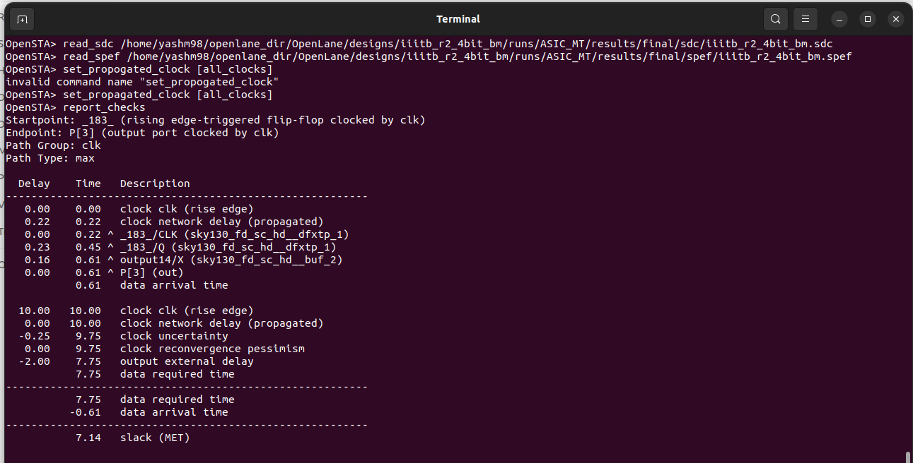
 
 ```
 Performance = 1/(clock period - slack) = 1/(10 - 7.14)ns = 349.650 Mhz
 ```
 
 ### 4. Flipflop to Cell Ratio
 
 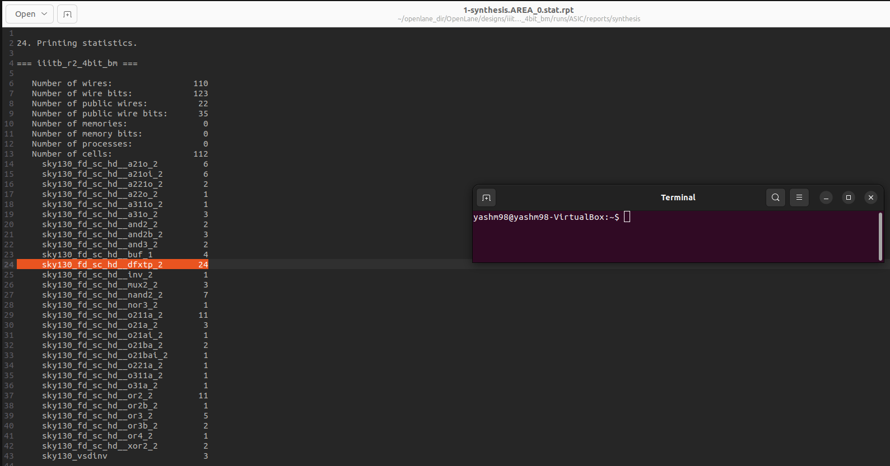
 
 ```
 Flop Ratio = Ratio of total number of flip flops / Total number of cells present in the design = 24/112 = 0.2143
 ```
 ### 5. Power
 
 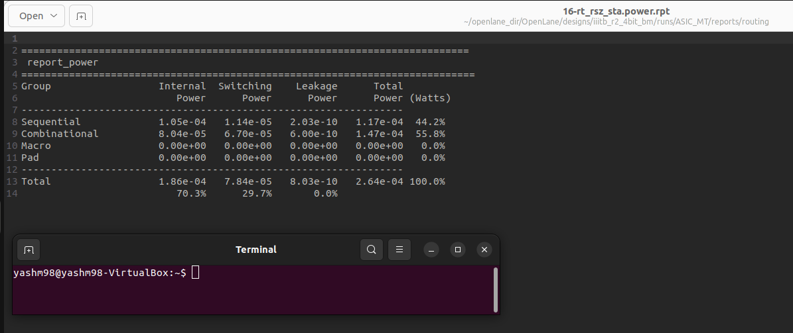
 
 ```
 Internal Power  =  186uW  (70.3%)
 Switching Power = 78.4uW  (29.7%)
 Leakage Power   = 0.803nW (0.0%)
 Total Power     =   264uW (100%)
 ```

 ## Contributors 
 
 * Yashwant Moses, MS IIIT Bangalore
 * Kunal Ghosh, Director, VSD Corp. Pvt. Ltd.
 
 ## Acknowledgement 
 
 * Kunal Ghosh, Director, VSD Corp. Pvt. Ltd.
 
 ## Contact 
 
 * Kunal Ghosh, Director, VSD Corp. Pvt. Ltd. kunalghosh@gmail.com
 * Yashwant Moses, MS IIIT Bangalore. yashwantmoses123@gmail.com
